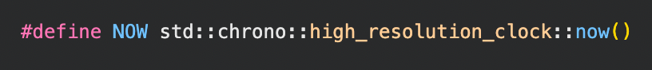
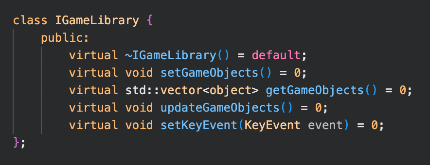
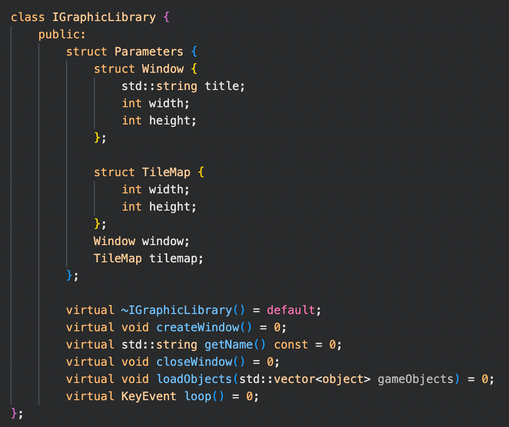

# Project Arcade

**The goal of this project :**

Arcade is a gaming platform: a program that lets the user choose a game to play and keeps a register of player scores.
To be able to deal with the elements of your gaming plateform at run-time, your graphics libraries and your games must be implemented as dynamic libraries, loaded at run-time.

**Interface sharing**

We share our interface with one other project group.
After turn-in, it will therefore be possible to run your games using their launcher and graphical libraries, and vice-versa.

# Games

**Pacman**

Pacman is an arcade video game released in 1980.
The goal is to explore a maze in order to eat all the “pacgums” in it while avoiding ghosts.

**Nibbler**

Nibbler is a simple arcade video game released in 1982.
Its concept has spread mainly thanks to the cult game Snake.
Nibbler itself was inspired by another great classic: Blockade, itself inspired from Tron Light Cycle.

# Interactions


KeyEvent enumeration list all the interactions handled by the Core of the Project.

# Sprites and Items

# Time



NOW is an ```std::chrono::high_resolution_clock::now()``` used for timers in games.

# IGameLibrary




# IGraphicLibrary



The Parameters structure is used to comunicate game specifications.

By Léo Neumuller, Jérémie Germond and Marine Poteau